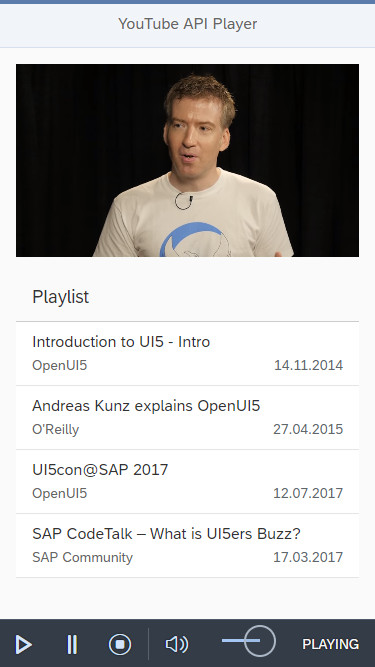

# YouTube Player

> This demo shows the usage of the [YouTube Player API Reference for iframe Embeds](https://developers.google.com/youtube/iframe_api_reference) from inside a custom UI5 control.

## [OpenUI5 Developer Blog](http://openui5.blogspot.com/2018/04/youtube-player.html)

### [Online Demo (SAP HCP)](https://youtube-p1940953245trial.dispatcher.hanatrial.ondemand.com/index.html)

### Highlights
- app showing usage of UI5 [YouTube Player API Reference for iframe Embeds](https://developers.google.com/youtube/iframe_api_reference)
- response grid layout to fit all device types
- css hack to allow responsive defined aspect ratio of video (eg. 16/9 or 4/3)
- wrapper methods and events to control video from UI5

## License

Released under the [Apache license](http://www.apache.org/licenses/). Have at it.
